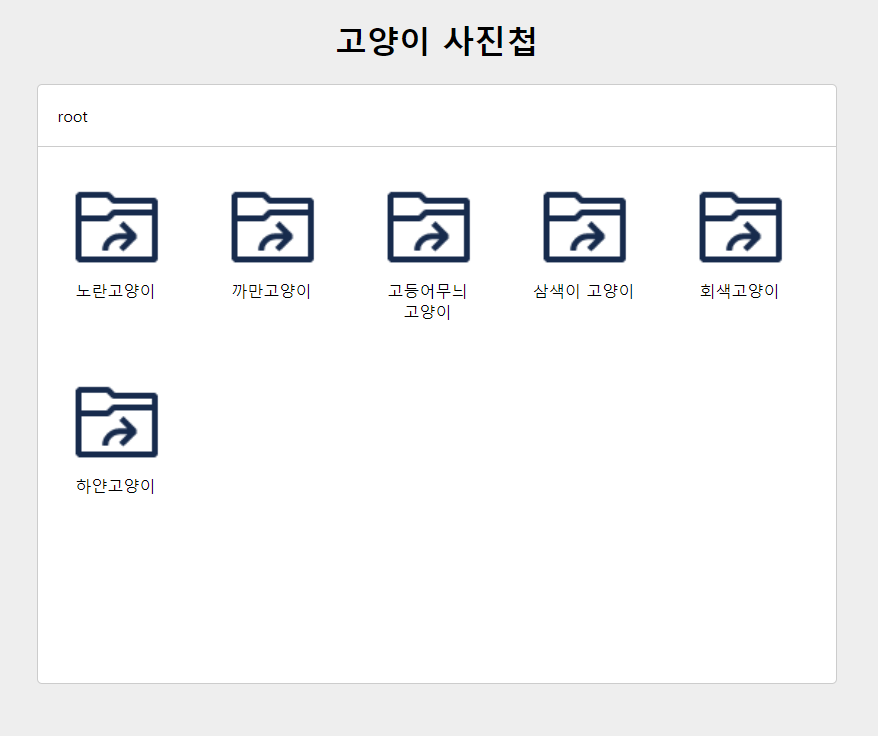
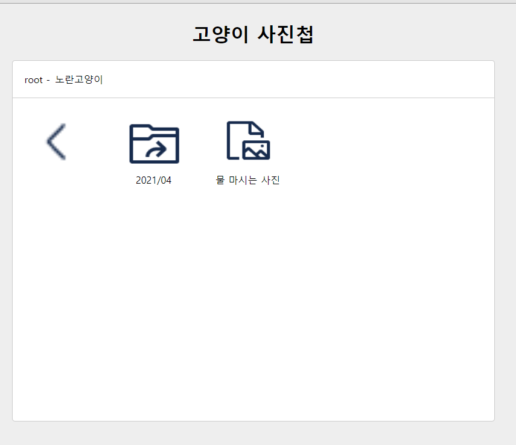
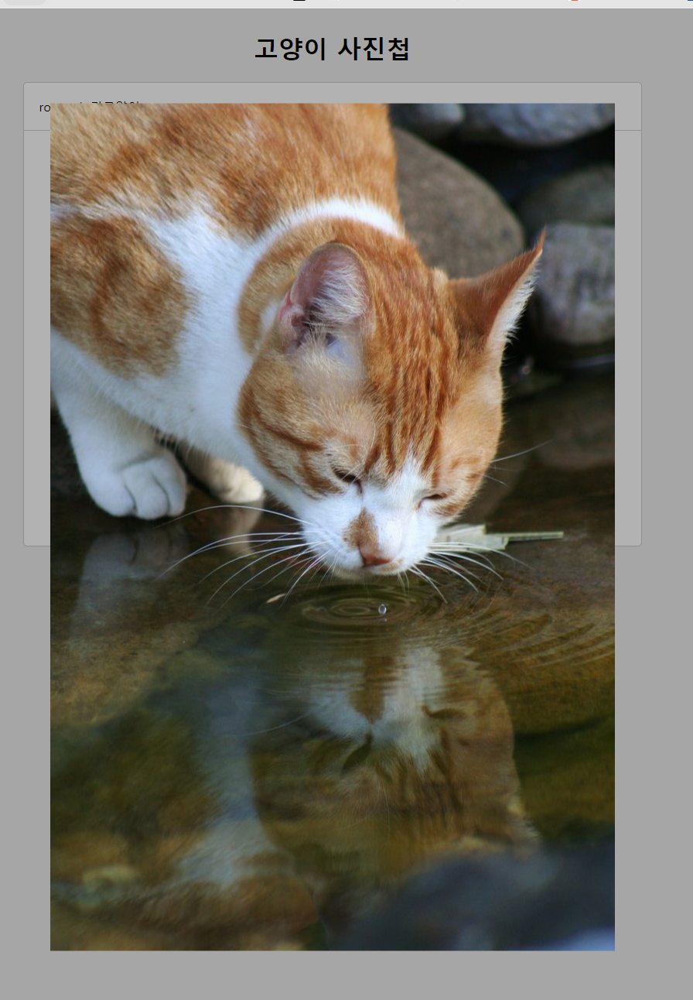

# 느낀점

## 내 코드의 문제점

### 1. 한 함수에서 다양한 일들을 처리하게 만들어, 단일 책임 원칙을 준수하지 않는다.

아래는 나의 기존 코드이다.

```
    const $ImageViewer = document.querySelector(".ImageViewer");
    if ($div && $div.classList.contains("Node")) {
      if ($div.dataset.filePath) {
        $ImageViewer.classList.remove("hide");

        const $img = $ImageViewer.querySelector("img");
        $img.src = `.${$div.dataset.filePath}`;
      } else if ($div.classList.contains("prev")) {
        const { path } = this.state;
        const nextId = path[path.length - 2].id;
        prevOnClick(nextId);
      } else {
        onClick($div.dataset.id, $div.querySelector(".name").innerText || null);
      }
    }
    if (!$ImageViewer.classList.contains("hide") && e.target === $ImageViewer) {
      $ImageViewer.classList.add("hide");
    }
```

Nodes.js의 이벤트 핸들러 함수인데 한 이벤트 핸들러에서 ImageViewer가 클릭되었을 때 모달 띄우기, 모달 닫기, 일반 directory를 클릭했을 때 onClick 호출, 뒤로가기 클릭했을 prevOnClick 호출 등 여러가지 함수를 동시다발적으로 호출하여 코드가 읽기 불편하였다.<br>
해설에서는 ImageViewer와 Loading 각각 하나의 컴포넌트로 만들어 상태값에 의해 화면에 보여주고 말고를 결정하였다. 오로지 상태값에 의존해서 말이다.<br>
왜인지 모르겠으나 모달창이나 loading을 컴포넌트로 뺸다는 생각은 못했다.🥲
따라서 SPA(single page app)은 state만 읽으면 모든게 보여지고 숨겨지게 렌더링해야 한다. 모달창을 특정 상황에서 보여줘야한다면 어느 부분의 코드 조각에서 "해당 버튼을 click시, hide된것을 show해주세요"라고 명령하는 것이 아니라 중앙에 선언된 상태값을 this.state = {isModal: true/false}와 같이 주어 랜더링 함과 동시에 해당 내용을 보여주는 컴포넌트를 따로 만들어야 한다는 말이다.<br><br>
컴포넌트 간에 의존도를 줄인다는 말은 App에서 state로 중앙에서 관리를 해주어야 한다는 것<br>
이벤트를 사용을 최적화하라는 말은 이벤트 위임을 사용하라는 것<br>

---
<br>
2. 캐시를 전역변수로 빼지 않고 상태 안에 넣고 관리했다.<br>
3. api 호출하는 구간은 모두 try-catch로 예외처리를 하지 않았다.<br>
4. 구현하다 보니까 내가 뭘 하고있었는지 자주 까먹고 머리가 엉켰다. 이를 방지하기위해 요구사항 분석과 그걸 어떻게 해결할지를 계속 적고 해결하며 구현해야 겠다 - 내일 중으로 클린 아키텍쳐라는 책을 읽어볼까 한다<br>
5. 문제 설명을 처음에 약간 오해를 했었는데 설명을 꼼꼼히 읽고 설계를 탄탄하게 해서 구현을 하는 편이 좋을 것 같다는 생각이 들었다.
<br>
<br>
<br>
<br>
<br>
<br>

---

# 문제 보기

## 문제지

당신은 고양이들을 모시고 있는 어느 집사에게 자신의 고양이 사진을 관리해달라는 의뢰를 받았습니다.

의뢰인은 당신이 믿을만한 사람인지 테스트하기 위해, 약간의 사진을 당신에게 보냈으며 이 사진들을 웹에서 볼 수 있도록 해달라고 합니다.

이 사진을 어떻게 처리할까 고민 중이던 때, 당신의 절친한 친구 Back-end 개발자가 당신을 돕기 위해 의뢰인이 보낸 사진들을 API 형태로 만들어주었습니다.

이 API를 이용해, 의뢰인을 만족시킬 수 있는 고양이 사진첩 애플리케이션을 만들어봅시다!

## 애플리케이션 예시 이미지

아래와 같이 디렉토리 구조를 따라 탐색할 수 있는 사진첩 애플리케이션을 만듭니다.

### root 경로 탐색 중인 경우



- 디렉토리를 클릭한 경우 해당 디렉토리 하위에 속한 디렉토리 / 파일들을 불러와 렌더링합니다.
- 디렉토리 이동에 따라 위에 Breadcrumb 영역도 탐색한 디렉토리 순서에 맞게 업데이트가 되어야 합니다.

### root - 노란고양이(디렉토리) 를 탐색 중인 경우



- 맨 왼쪽 화살표를 누른 경우, 이전 디렉토리로 돌아갑니다.
  파일을 누른 경우 해당 파일의 filePath 값을 이용해 이미지를 보여줍니다.
- 물 마시는 사진(파일)을 클릭한 경우
  

- esc를 누르거나 사진 영역 밖을 클릭한 경우 이미지를 닫아야합니다.

## 구현 시 유의사항

- 주어진 샘플 코드 내에서 구현을 해야합니다. 별도의 라이브러리 등을 설치하거나 불러와서 사용하는 행위는 금지합니다.
- 각 화면의 UI요소는 가급적 컴포넌트 형태로 추상화 하여 동작하도록 합니다.
  - 각 컴포넌트가 서로 의존성을 지니지 않고, App 혹은 그에 준하는 컴포넌트가 조율하는 형태로 동작하게 만드는 것을 지향합니다.
- API 호출 중 에러가 발생했을 때의 처리를 한 경우 가산점이 있습니다.
  - 의존성이 느슨한 구조로 작성한 경우 가산점이 있습니다.
  - 오류가 발생한 경우를 체크하는 경우 가산점이 있습니다.
  - 오류가 발생했음을 사용자에게 인지 시킨 경우 가산점이 있습니다.
- ES6 모듈 형태로 작성한 경우 가산점이 있습니다.
- API를 호출하는 함수는 가급적 fetch 함수를 사용합니다.
  - async, await 문을 사용한 경우 가산점이 있습니다.
  - fetch 외의 방법을 사용할 경우, 동기 호출 방식으로 사용해서는 안 됩니다.
- API를 처리하는 코드를 별도의 코드로 분리해주세요.
- 기본적으로 아래 마크업 가이드에서 제공하는 구조와 class명을 사용하여 작업합니다. 이를 처리하기 위한 style은 src/styles/style.css 에서 참고 할 수 있습니다.
- 그 외 알아보기 쉬운 네이밍, 일관된 코드 포맷팅 규칙 등을 유지하도록 하며, 코드 중복은 지양합니다.
- 전역 오염을 최소화 합니다.
- 이벤트 바인딩은 가급적 최적화 해서 사용합니다.

## 필수 구현사항

- app이라는 class를 가진 main에 애플리케이션을 렌더링합니다.
- index.html에 기본으로 있는 마크업 구조를 참고하여, 애플리케이션을 크게 세 가지 영역으로 나누어서 렌더링합니다.

  - Breadcrumb - 현재 탐색 중인 경로를 나타냅니다. root를 맨 왼쪽에 넣어야하며, 탐색하는 폴더 순서대로 나타냅니다.

  - 사진첩을 처음 들어간 상태라면 root 경로를 탐색 중이므로 root 만 나와야 합니다.
  - root를 기준으로 노란고양이 를 클릭했다면 root - 노란고양이 처럼 root를 시작지점으로 하여 거쳐간 디렉토리 이름을 순서대로 나열해야 합니다.
  - 마크업은 아래를 참고합니다.

```
<nav class="Breadcrumb">
  <div>root</div>
  <div>노란고양이</div>
</nav>
```

- Nodes - 현재 탐색 중인 경로에 속한 파일 / 디렉토리를 렌더링합니다. 렌더링 된 Node 클릭 시 node의 type에 따라 다음과 같은 일이 일어나야 합니다.

  - DIRECTORY: 해당 디렉토리에 속한 파일 / 디렉토리를 불러와 아래의 형태로 렌더링합니다. 마크업은 아래 형태와 같습니다.

  ```
  <div class="Node">
  	
  	<div>2021/04</div>
  </div>
  ```

  - FILE: Node의 filePath값을 이용해 이미지를 불러와 화면에 렌더링합니다. 마크업은 아래 형태와 같습니다.

  ```
  <div class="Node">
  	
  	<div>하품하는 사진</div>
  </div>
  ```

  - root 경로가 아닌 경우, Nodes 목록 맨 왼쪽에 이전 디렉토리로 이동할 수 있는 기능을 구현해야 합니다. 마크업은 아래를 참고합니다.

  ```
  <div class="Node">
  	
  </div>
  ```

- ImageView - 파일을 클릭한 경우 Modal을 하나 띄우고 해당 Modal에서 파일의 이미지를 렌더링합니다. 마크업은 아래를 참고합니다.

```
<div class="ImageViewer">
  <div class="content">
    
  </div>
</div>
```

## 옵션 구현사항

아래의 구현사항은 필수는 아니지만, 구현 시 가산점이 있습니다.

- Breadcrumb에 렌더링 된 경로 목록의 특정 아이템을 클릭하면, 해당 경로로 이동하도록 처리합니다. ex) Breadcrumb에 root - 노란고양이 - 2021/04 가 렌더링 된 상태인 경우
  - 2021/04 를 클릭한 경우 현재 경로와 같으므로 아무 일도 일어나지 않음
  - 노란고양이 를 클릭하면 노란고양이 경로 기준으로 파일 / 디렉토리 목록 렌더링
  - root 를 클릭하면 root 경로 기준으로 파일 / 디렉토리 목록 렌더링.
- 파일을 클릭하여 이미지를 보는 경우, 닫을 수 있는 처리를 해야합니다.
  - ESC키를 눌렀을 때와 이미지 밖을 클릭했을 때, 둘 중 한 가지 혹은 두 가지 모두 처리합니다.
- 데이터가 로딩 중인 경우는 로딩 중임을 알리는 UI적 처리를 해야하며, 로딩 중에는 디렉토리 이동이나 파일 클릭 등 액션이 일어나는 것을 막아야 합니다.
- 한번 로딩된 데이터는 메모리에 캐시하고 이미 탐색한 경로를 다시 탐색할 경우 http 요청을 하지 말고 캐시된 데이터를 불러와 렌더링하도록 합니다.

## API 개요

두 개의 API를 사용합니다.

### root 내용 가져오기

- https://zl3m4qq0l9.execute-api.ap-northeast-2.amazonaws.com/dev
- method: GET
  사진첩의 root 경로에 있는 파일들과 디렉토리들을 불러옵니다.

응답의 예시는 아래와 같습니다.

```
[
  {
        "id": "1",
        "name": "노란고양이",
        "type": "DIRECTORY",
        "filePath": null,
        "parent": null
    },
    {
        "id": "3",
        "name": "까만고양이",
        "type": "DIRECTORY",
        "filePath": null,
        "parent": null
    },
 .....
]
```

### 특정 디렉토리에 속하는 파일 / 디렉토리 불러오기

- https://zl3m4qq0l9.execute-api.ap-northeast-2.amazonaws.com/dev/:nodeId
- method: GET
  nodeId 하위에 있는 파일 / 디렉토리 목록을 불러옵니다.
  응답의 예시는 아래와 같습니다.

```
// https://zl3m4qq0l9.execute-api.ap-northeast-2.amazonaws.com/dev/1 호출 시

[
    {
        "id": "5",
        "name": "2021/04",
        "type": "DIRECTORY",
        "filePath": null,
        "parent": {
            "id": "1"
        }
    },
    {
        "id": "19",
        "name": "물 마시는 사진",
        "type": "FILE",
        "filePath": "/images/a2i.jpg",
        "parent": {
            "id": "1"
        }
    }
]
```

두 API에서 사용하는 데이터의 형태는 모두 아래의 형태를 띕니다.

```
{
  "id":       string // 문자열로 된 Node의 고유값입니다.
  "name":     string // 디렉토리 혹은 파일의 이름입니다. 화면에 표시할 때 사용합니다.
  "type":     string // 파일인지 디렉토리인지 여부입니다. 파일인 경우 FILE, 디렉토리인 경우 DIRECTORY 입니다.
  "filePath": string // 파일인 경우에 존재하는 값입니다. 해당 파일 이미지를 불러오기 위한 경로가 들어있습니다.
  "parent":   object | null {
    "id": string // 해당 Node가 어디에 속하는지 나타내는 값입니다. parent가 null이면 root에 존재하는 파일 / 디렉토리입니다.
  }
}
```

### 이미지 불러오기

- Node의 filePath 값을 아래의 값과 조합하여, 이미지를 불러올 수 있는 주소를 만들 수 있습니다.
- filePath 맨 앞에 /가 포함될 수도 있으므로, 아래의 값과 잘 조합하여 이미지를 불러오도록 합니다.

```
https://fe-dev-matching-2021-03-serverlessdeploymentbuck-t3kpj3way537.s3.ap-northeast-2.amazonaws.com/public/${node.filePath}
```
