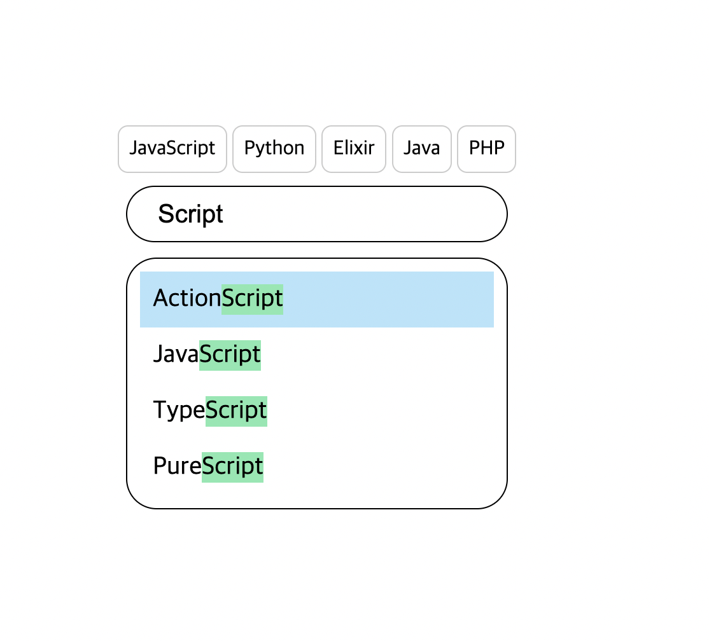
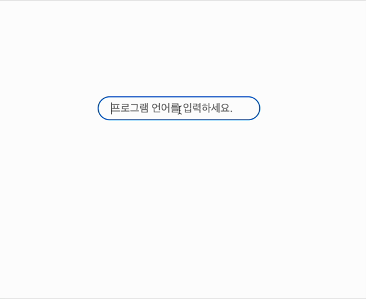

## 문제 보기

# 문제 설명



여러분은 자신이 좋아하는 프로그래밍 언어를 검색할 수 있는 서비스를 만드려고 합니다. 검색어를 입력하면 해당 검색어를 기준으로 서버에 요청을 하고, 서버에서 받은 검색어 목록을 렌더링 합니다. 검색어를 선택하거나 엔터키를 누르면 아래 요구사항에 맞게 동작하도록 만들어 봅시다.

## 필수 구현사항

- 주어진 마크업을 참고하여 구현해야 합니다. 특히 각 태그의 class 이름을 바꾸거나 스타일을 임의로 추가해서는 안 됩니다. 반드시 주어진 마크업 내에서만 작업을 하도록 합니다.
- 반드시 fetch를 이용하여 API를 조회해주세요.
  <br>

## 언어 검색


- 처음 화면에 접속하면 input 하나만 떠있습니다.
- 여기서 키보드를 통해 검색 키워드를 입력하면 input 아래에 입력한 검색어를 기준으로 언어 목록을 렌더링합니다. 추천 검색어는 아래 설명된 API를 통해 요청합니다.
- 화살표 위, 아래로 추천된 언어 목록을 순회할 수 있도록 합니다. 이때 제시된 샘플 코드를 기반으로 몇번째 언어를 순회 중인지 표시하도록 합니다. (Suggestion\_\_item--selected class 이용)
  - 이 상태에서 엔터키를 누르는 경우, 아래 명시된 언어 선택 동작이 이루어지도록 합니다.
  - 화살표 키를 누를 때는 검색 동작이 일어나면 안 됩니다. 관련하여 예외처리를 적절하게 해주세요.
  - 순회 시 첫번째 요소에서 화살표 위를 누르면 맨 끝으로, 맨 끝에서 화살표 아래를 누르면 맨 처음으로 와야 합니다.
- input 내 검색어를 모두 삭제할 경우, 추천 검색어 및 추천 검색어를 띄워준 창을 보이지 않게 합니다.

### 언어 선택

---



- 언어 선택 처리를 합니다. + 언어 목록이 렌더링 된 상태에서 엔터키를 누르는 경우, 현재 선택처리된 언어를 alert으로 띄우고 아래에 제시된 동작을 합니다. + 언어 목록이 렌더링 된 상태에서 언어를 클릭한 경우, 해당 언어를 alert으로 띄우고 아래에 제시된 동작을 합니다. + 단순히 선택된 검색어에 대해 alert만 띄우면 됩니다. + 다른 문자열 첨가 없이 언어명만 alert으로 띄워야 합니다.
  <br>

### 선택된 언어 렌더링


---

- 선택된 검색어를 alert으로 노출한 다음, 주어진 마크업을 참고하여 SelectedLanguage에 렌더링 합니다.
- 이미 선택된 언어를 다시 검색하여 선택처리하여도 중복으로 들어가서는 안 됩니다.
  - 이미 선택된 언어를 다시 넣으면 순서상 맨 뒤로 들어가야 합니다.
    - 예시: JavaScript, TypeScript, Python이 선택된 상태에서 JavaScript를 다시 검색해서 선택하면 TypeScript, Python, JavaScript 순서가 되어야 함
- 언어는 최대 다섯개까지 넣을 수 있으며, 다섯개를 초과하는 경우 가장 처음에 넣은 언어를 제거하고 넣습니다. (FIFO) + 예시: ActionScript, JavaScript, TypeScript, Java, Python이 들어간 상태에서 Kotlin을 검색하고 선택한다면 JavaScript, TypeScript, Java, Python, Kotlin이 되어야 함
  <br>

## 보너스 구현사항

### 사용성 개선

- 화면에 접속하면 input에 focus가 자동으로 가도록 합니다.
- 렌더링 된 추천 언어 목록 내에서 입력한 키워드와 일치하는 문자열에 대해서 Suggestion\_\_item--matched 클래스를 사용하여 강조 처리를 합니다.
  - 주어진 샘플코드의 스타일을 참고하여 작업합니다.
  - 해당 샘플코드의 가이드대로 하지 않으면 구현하고도 해당 항목이 채점에서 누락될 수 있습니다.

### API 사용 최적화

- 검색어를 입력하는 동안은 API 호출을 지연하고, 검색어 입력이 완료 되었다고 판단이 되는 경우 API를 호출하도록 최적화 처리를 합니다.
- 검색어에 따른 API 응답을 캐시해서 사용합니다. 검색어 캐시의 경우, 브라우저를 닫았다 다시 켜면 초기화 되어야 합니다.

### 기타

- 화면을 닫았다 다시 켜도 선택된 언어 목록이 유지되도록 만듭니다.
- 화면을 닫았다 다시 켜도 마지막 화면 상태가 모두 유지되도록 만듭니다.
  - 입력중이던 검색어, 검색된 언어 목록 등
- 각 스크립트는 용도에 맞게 적절히 분리하여 별도의 파일로 작성해주세요.

## 구현 시 참고사항

- 각 요구사항을 구현할 때는 에러가 발생할 수 있는 상황에 대해서는 최대한 방어코드를 작성해야 합니다.
  - 기능을 잘 구현했더라도 특정 입력값에서 동작하지 않는다면 구현하지 않은 것으로 간주합니다.
- 필수 구현사항을 모두 구현해야하며, 보너스 구현사항은 구현 시 추가점수가 있습니다.

## API 문서

Base URL : https://wr4a6p937i.execute-api.ap-northeast-2.amazonaws.com/dev

### 프로그래밍 언어 조회

- /languages
- Method : GET
- Query Parameter : keyword
- 검색하고자 하는 키워드를 query parameter로 넘기면 조건에 맞는 데이터를 조회하여 응답합니다.

```
// 'java'라는 키워드로 조회
/languages?keyword=java

// 응답 결과는 다음과 같습니다.
[
	"Java",
	"JavaFX Script",
	"JavaScript",
	"Join Java"
]
```
